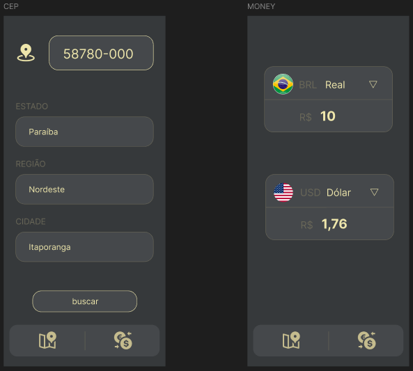

# 📱 MultiApp - Aplicativo Multifuncional


MultiApp é um aplicativo desenvolvido em Flutter que combina duas ferramentas essenciais: consulta de CEP integrada com a API ViaCEP e um conversor de moedas para cálculos financeiros.

## Funcionalidades

### 🔍 Consulta de CEP
- Integração com API ViaCEP
- Busca automática ao digitar 8 dígitos
- Exibe:
  - ✅ Estado (UF)
  - 🏙️ Cidade
  - 🌎 Região
- Validação de CEP inválido

### 💱 Conversor de Moedas
- Conversão entre múltiplas moedas
- Interface intuitiva
- (Em desenvolvimento) Taxas atualizadas

## 🛠️ Tecnologias

- **Flutter** 3.19+
- **Dart** 3.3+
- Pacotes:
  - `http` para requisições API
  - `flutter/services` para input
  - `material` para UI

## Como Executar

1. Clone o repositório:
```bash
git clone https://github.com/seu-usuario/multiapp.git
```
2. Acesse o diretório:
```bash
cd multiapp
```

3. Instale as dependências:
```bash
flutter pub get
```

4. Execute o app:
```bash
flutter run
```

## 📸 Screenshots
### Telas CEP - Convert

  

📝 Estrutura do Código
```text
lib/
├── COMOM/
│   ├── bottomBar.dart    # Barra de navegação
│   └── cores.dart        # Paleta de cores
├── pages/
│   ├── cep.dart              # Tela de consulta CEP
|   └── convert.dart          # Tela de conversão
└── app.dart          # código principal
```

🤝 Contribuição

Contribuições são bem-vindas! Siga os passos:

    Faça um fork

    Crie sua branch (git checkout -b feature/nova-funcionalidade)

    Commit suas mudanças (git commit -m 'Adiciona nova funcionalidade')

    Push para a branch (git push origin feature/nova-funcionalidade)

    Abra um Pull Request
